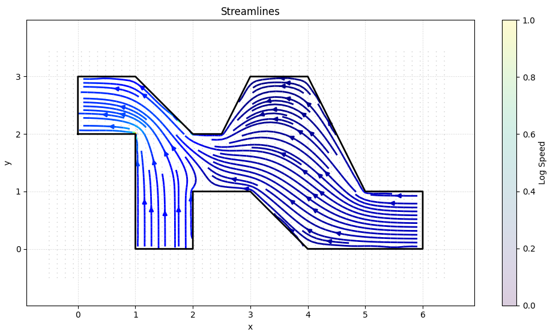

# ポテンシャル流れ解析 with BEM

境界要素法（BEM: Boundary Element Method）を用いて、2次元ポテンシャル流れを数値解析するPythonプログラムです。

## 概要

本シミュレーションでは、迷路のような複雑な領域において、入り口から出口へ至る流れ場を計算することを目的としています。非圧縮・非回転・非粘性かつ定常な流れを仮定し、支配方程式であるラプラス方程式を境界積分方程式に変換して数値的に解析します。

BEMは、境界領域の解析のみを離散化するため、メッシュ生成が容易で計算コストを抑えられるという利点があります。本プログラムでは、以下の手順で解析を行います。

1. **形状定義**: 解析領域の境界（壁、入口、出口）を線分要素で定義
2. **境界条件設定**:
   - 入口・出口: ポテンシャル値を指定（ディリクレ条件）
   - 壁面: 法線方向の流速をゼロに設定（ノイマン条件）
3. **BEM計算**: 境界積分方程式を解き、境界上の未知量を算出
4. **内部流速計算**: 得られた境界値から領域内部の速度場を計算
5. **可視化**: 速度ベクトルと流線をプロット

詳細な理論的背景や数式の導出については、[bem_potential_flow.md](bem_potential_flow.md) を参照してください。現在、本プログラムは2次元での解析にのみ対応しています。

## 実行方法

### 1. ライブラリのインストール

本プログラムはPython3で実装されています。実行には以下のライブラリが必要です。

```bash
pip install numpy matplotlib
```

### 2. シミュレーションの実行

以下のコマンドを実行すると、main_2d.py 内で定義された形状と境界条件に基づいた解析が実行され、結果がプロットされます。

```bash
python codes/main_2d.py
```

実行すると、以下のような流れ場の可視化結果が表示されます。以下は`codes/main_2d.py`内の`_boundary_example_2`関数で定義された例の出力例です。

<center></center>

<center><b>Fig. 1</b> 解析領域内の速度ベクトルの可視化例</center>

## ファイル構成

**ルートディレクトリ**:

- [README.md](README.md): 本ドキュメントファイル
- [`bem_potential_flow.md`](bem_potential_flow.md): ポテンシャル流れ解析に関する理論的背景と数式の導出を説明するドキュメント

**codes**: シミュレーションのメインコードが含まれています。

- [`main_2d.py`](codes/main_2d.py): 2Dポテンシャル流れ解析のメインスクリプト

## ライセンス

本リポジトリのコードはMITライセンスの下で公開されています。詳細は[LICENSE](LICENSE)ファイルを参照してください。
